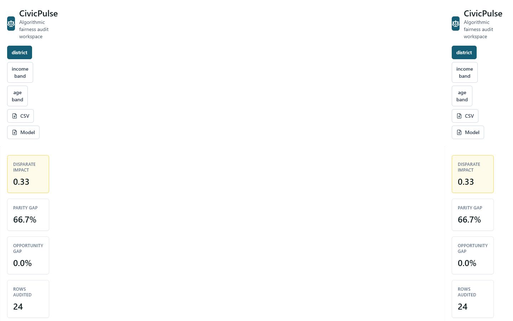
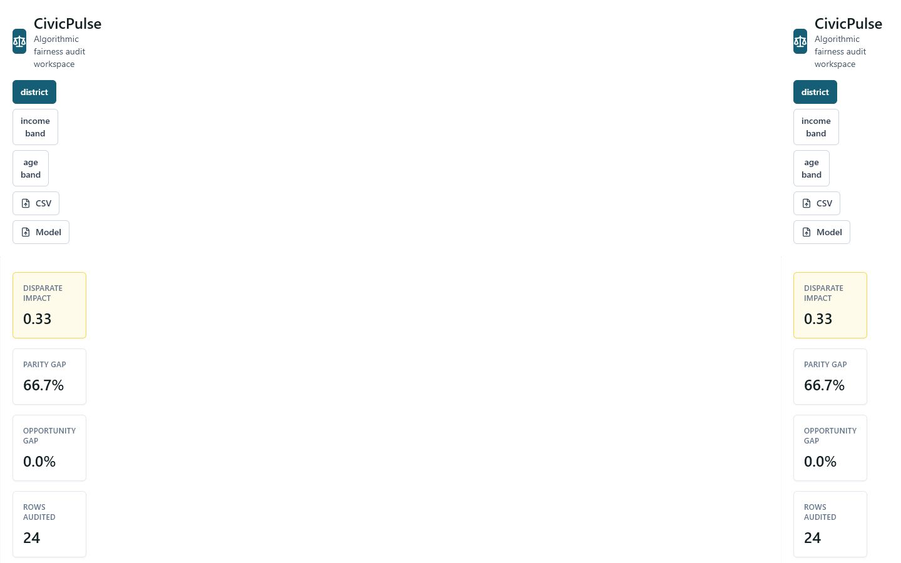
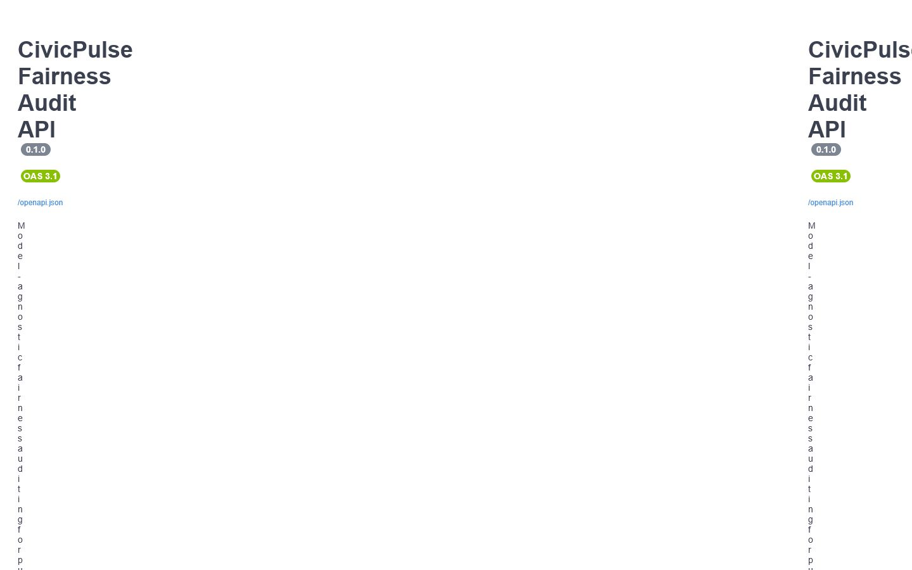
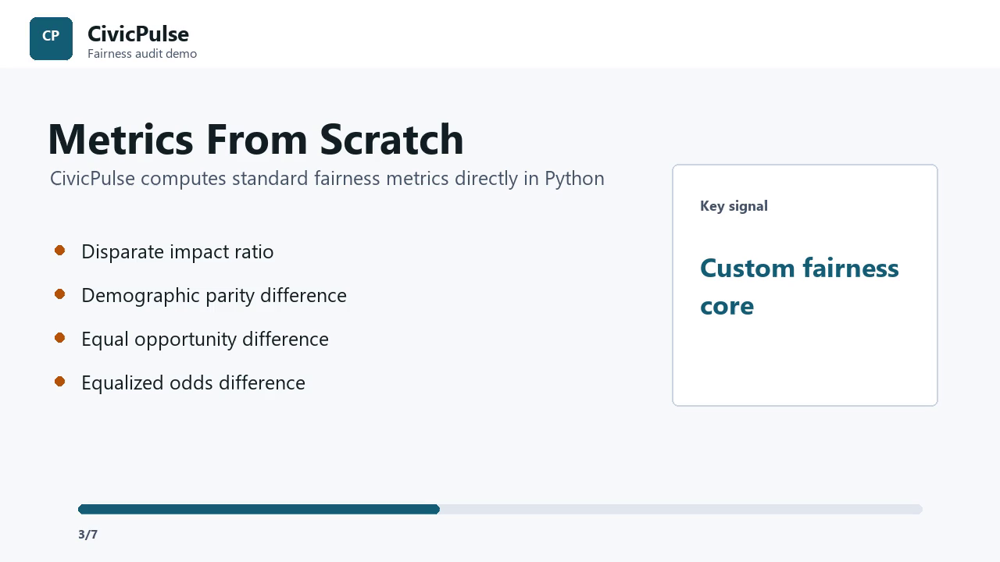

# CivicPulse

[](https://github.com/snehaprasad11/CivicPulse/actions/workflows/ci.yml)

Algorithmic fairness auditing for public resource allocation decisions.

CivicPulse is a full-stack, model-agnostic auditing platform for policy analysts, NGOs, and city teams who need to inspect whether an eligibility or prioritization model treats protected groups differently. It combines custom fairness metric implementations, explainability, mitigation simulation, and a deep adversarial debiasing baseline.

## Project Evidence

These screenshots are captured from the running CivicPulse application, not mockups.







The repository also includes a generated walkthrough video for a housing-assistance fairness-audit scenario: [demo/civicpulse_demo.mp4](demo/civicpulse_demo.mp4).



## Implemented Scope

- React + Tailwind PWA dashboard connected to the FastAPI backend.
- FastAPI audit API with sample-data audit, CSV upload, and uploaded-model audit paths.
- Custom Python fairness metrics implemented in the project core instead of relying on a fairness library wrapper.
- SHAP/LIME explainability path with deterministic fallbacks for stable demos and tests.
- PyTorch adversarial debiasing model benchmarked against logistic regression and XGBoost.
- Ollama-compatible summary hook with a fallback plain-English report generator.
- Power BI build kit: export endpoints, sample CSVs, DAX measures, Power Query scripts, schema, and report layout guide.
- Kaggle starter notebook and public OpenML German Credit data preparation script.
- GitHub Actions CI for backend tests and frontend build checks.

## What It Does

- Upload or use a sample civic resource-allocation dataset.
- Upload a trained `.pkl`, `.pickle`, or `.joblib` model through the API or dashboard.
- Audit fairness across protected attributes such as district, age band, and income band.
- Compute fairness metrics from scratch:
  - Disparate impact ratio
  - Demographic parity difference
  - Equal opportunity difference
  - Equalized odds difference
- Show model performance and group-level approval/denial patterns.
- Generate plain-English summaries for non-technical stakeholders.
- Simulate mitigation strategies:
  - Group threshold adjustment
  - Instance reweighting
  - Adversarial debiasing neural network reference implementation
- Export city-dashboard-ready CSV files for Power BI.
- Compare logistic regression, XGBoost, and PyTorch adversarial-debiasing baselines.

## Repo Layout

```text
backend/      FastAPI service and ML fairness core
frontend/     React + Tailwind PWA dashboard
data/         Sample public-resource allocation dataset
docs/         Architecture, API, deployment, screenshots, and Kaggle notes
notebooks/    Kaggle notebook starter
powerbi/      Power BI dashboard schema and exported metrics
```

## Quick Start

### Backend

```bash
cd backend
python -m venv .venv
.venv\Scripts\activate
pip install -r requirements.txt
uvicorn app.main:app --reload --port 8000
```

### Frontend

```bash
cd frontend
npm install
npm run dev
```

The frontend expects the API at `http://localhost:8000`.

## Main API Endpoints

- `POST /audit`: audit the bundled sample dataset.
- `POST /audit/upload`: audit an uploaded CSV.
- `POST /audit/model-upload`: audit an uploaded CSV with an uploaded model artifact.
- `GET /benchmark/sample`: compare logistic regression, XGBoost, and PyTorch adversarial debiasing.
- `GET /exports/group-metrics.csv`: export Power BI-ready group metrics.
- `GET /exports/mitigation-results.csv`: export Power BI-ready mitigation results.

## Sample Dataset

The included sample dataset is synthetic, but shaped like a housing-assistance prioritization workflow. It is useful for demos, tests, and development without exposing real applicant data.

For a publishable Kaggle version, replace it with a public dataset such as HMDA mortgage data or an open housing-assistance dataset and keep the same audit pipeline.

Use `scripts/prepare_public_dataset.py` to normalize a public CSV into the columns CivicPulse expects.

You can also fetch and normalize the public OpenML German Credit dataset:

```bash
python scripts/fetch_openml_credit_dataset.py
```

This produces `data/public_credit_fairness.csv`, a credit-adjacent public dataset suitable for a reproducible fairness-audit notebook.

## Demo

The `demo/` folder includes a housing-assistance audit scenario, voiceover script, and short generated walkthrough video.

```bash
python scripts/generate_demo_video.py
```
